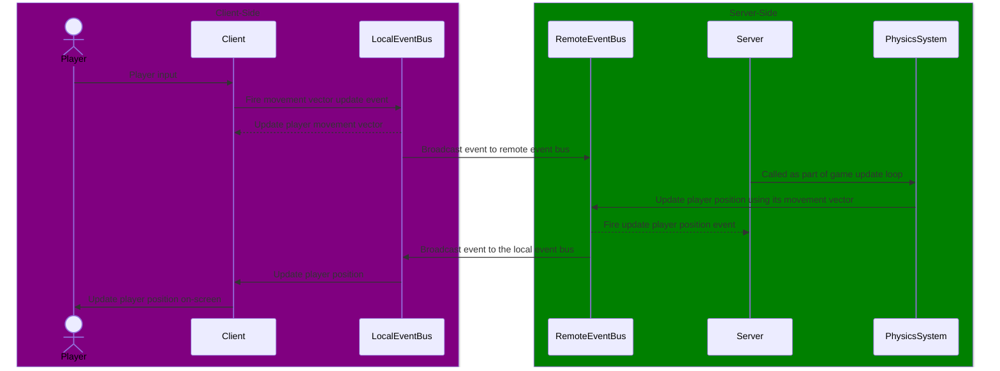

Player movement diagram:

```mermaid
sequenceDiagram
    box Purple Client-Side
    actor Player
    participant Client
    participant LocalEventBus
    end

    box Green Server-Side
    participant RemoteEventBus
    participant Server
    participant PhysicsSystem
    end

    Player->>Client: Player input
    Client->>LocalEventBus: Fire movement vector update event
    LocalEventBus-->>Client: Update player movement vector

    LocalEventBus->>RemoteEventBus: Broadcast event to remote event bus

    Server->>PhysicsSystem: Called as part of game update loop
    PhysicsSystem->>RemoteEventBus: Update player position using its movement vector
    RemoteEventBus-->>Server: Fire update player position event

    RemoteEventBus->>LocalEventBus: Broadcast event to the local event bus

    LocalEventBus->>Client: Update player position
    Client->>Player: Update player position on-screen
```
