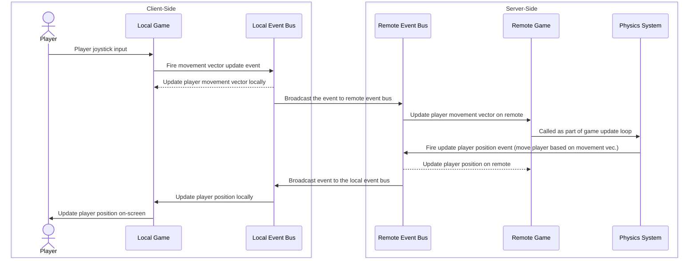

Player movement diagram:

```mermaid
sequenceDiagram
    box Client-Side
    actor Player
    participant Local Game
    participant Local Event Bus
    end

    box Server-Side
    participant Remote Event Bus
    participant Remote Game
    participant Physics System
    end

    Player->>Local Game: Player joystick input
    Local Game->>Local Event Bus: Fire movement vector update event
    Local Event Bus-->>Local Game: Update player movement vector locally

    Local Event Bus->>Remote Event Bus: Broadcast the event to remote event bus
    Remote Event Bus->>Remote Game: Update player movement vector on remote

    Remote Game->>Physics System: Called as part of game update loop
    Physics System->>Remote Event Bus: Fire update player position event (move player based on movement vec.)
    Remote Event Bus-->>Remote Game: Update player position on remote

    Remote Event Bus->>Local Event Bus: Broadcast event to the local event bus

    Local Event Bus->>Local Game: Update player position locally
    Local Game->>Player: Update player position on-screen
```
